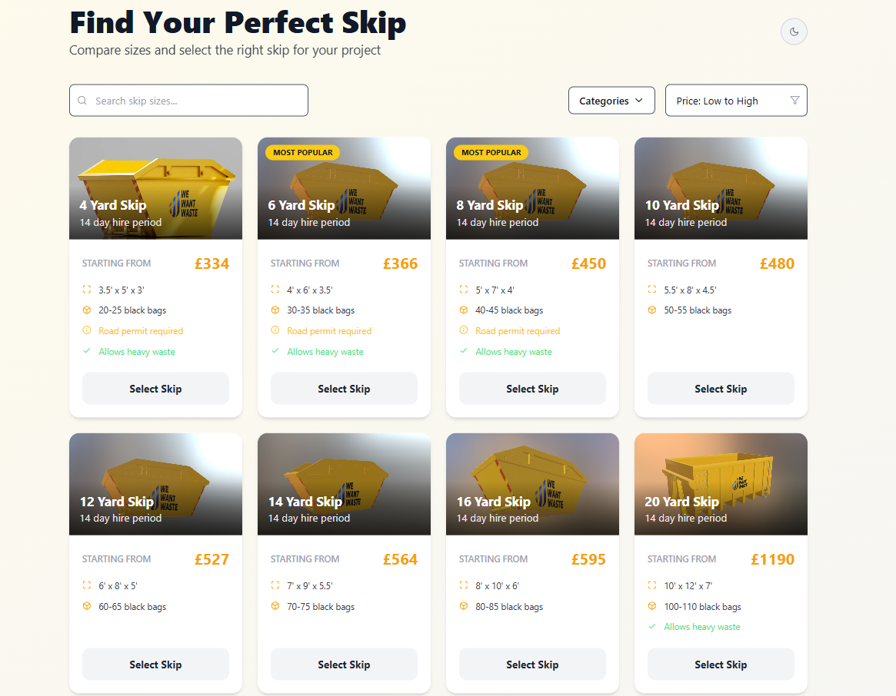
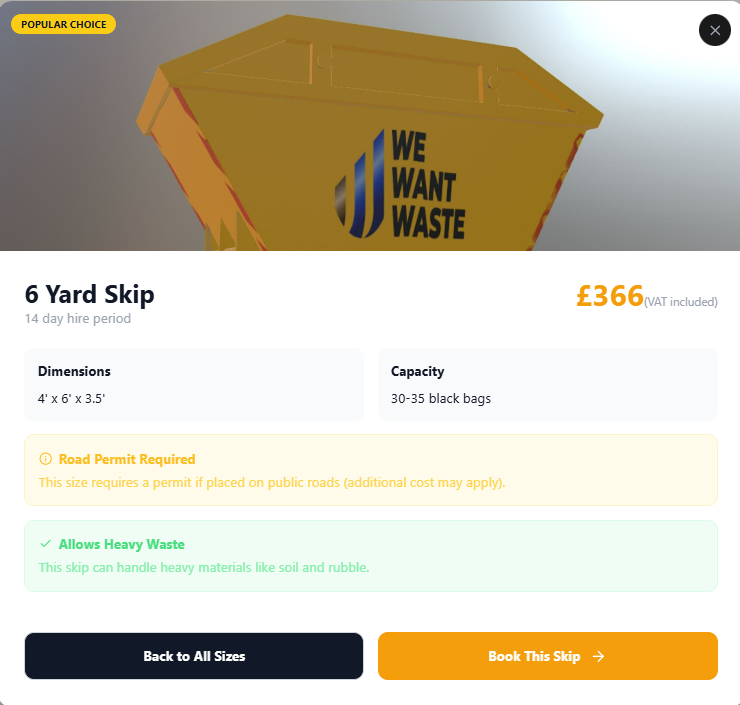
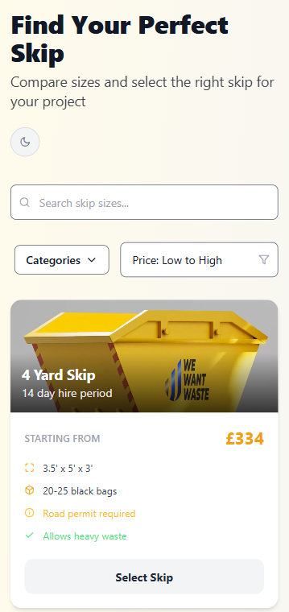
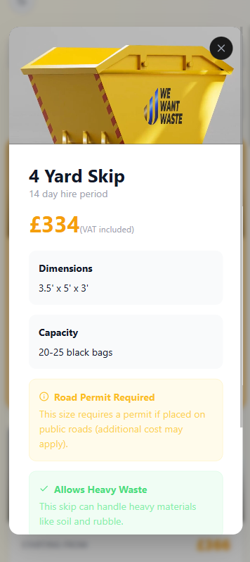

---

# REMWaste Skip Size Selector Redesign

## 🚀 Project Overview

This project is a comprehensive redesign of the "Choose Your Skip Size" page from [wewantwaste.co.uk](https://wewantwaste.co.uk/), developed as part of a coding challenge for a Mid-Level Full-Stack Developer position. The objective was to deliver a modern, accessible, and user-friendly experience leveraging best practices in UI/UX and modern web technologies.

---

## 🛠️ Getting Started

### Prerequisites

- Node.js (v16+ recommended)
- npm or yarn

### Installation

1. **Clone the repository**
   ```sh
   git clone https://github.com/ardicDemirol/REMWasteRedesign.git
   cd REMWasteRedesign
   ```
2. **Install dependencies**
   ```sh
   npm install
   ```
3. **Start the development server**
   ```sh
   npm run dev
   ```
4. **View in browser**
   Open [http://localhost:5173](http://localhost:5173) in your browser (or the port specified in your terminal).

---

## 🎨 Features & Design Decisions

- **Modern, Clean UI**: Redesigned from scratch with a focus on clarity, accessibility, and professionalism using Tailwind CSS.
- **Component-Based Architecture**: All UI elements (filters, skip cards, modals, theme toggle) are modular React components for maintainability and reusability.
- **Theme Support**: Light and dark mode toggle; all theme colors managed centrally for consistency.
- **API-Driven**: Skip size data is dynamically fetched and normalized from the provided API for real-time accuracy.
- **Accessibility**: Semantic HTML, ARIA labels, full keyboard navigation, and inclusive design.
- **Enhanced UX**:
  - Animated modals & transitions
  - Intuitive filtering & sorting controls
  - Visual feedback for selections
  - Robust error & empty-state handling
  - Mobile-friendly touch targets

---

## 📱 Responsiveness

- **Mobile-First**: Designed primarily for mobile, then enhanced for desktop.
- **Responsive Grid**: Tailwind ensures seamless adaptation from single-column to multi-column layouts.
- **Touch-Friendly**: All interactive elements optimized for touch devices.

---

## 🤖 Use of AI Tools

- **GitHub Copilot**: Extensively used for code generation, refactoring, and rapid prototyping.
- **AI-Assisted Design**: Leveraged Copilot for Tailwind class suggestions, accessibility, and documentation.
- **Productivity**: AI tools accelerated development and enabled a focus on higher-level design/UX.

---

## 🧩 Challenges & Solutions

- **API Data Mapping**: Created utility functions to normalize and enrich API responses for UI needs.
- **State Management**: Utilized React hooks and memoization for managing filters, sorting, and modal states.
- **Responsiveness**: Achieved pixel-perfect layouts using Tailwind's grid/flex utilities and custom media queries.
- **Theme Consistency**: Centralized theme management for scalability and easy maintenance.
- **Dropdown/Popover Logic**: Custom logic ensures accessibility and robust interaction handling.

---

## 🌐 Live Demo

- [CodeSandbox Demo](https://codesandbox.io/p/sandbox/github/ardicDemirol/REMWasteRedesign) <br>

---

## 🖼️ Screenshots

### Desktop



### Mobile
<div style="display: flex; justify-content: center; gap: 10px;">
  
  
</div>

---

## 📝 Summary

- The redesign emphasizes clean code, modularity, and a seamless experience across devices.
- All features prioritize accessibility and maintainability.
- AI tools were an integral part of the workflow, aligning with an AI-native product culture.

---
